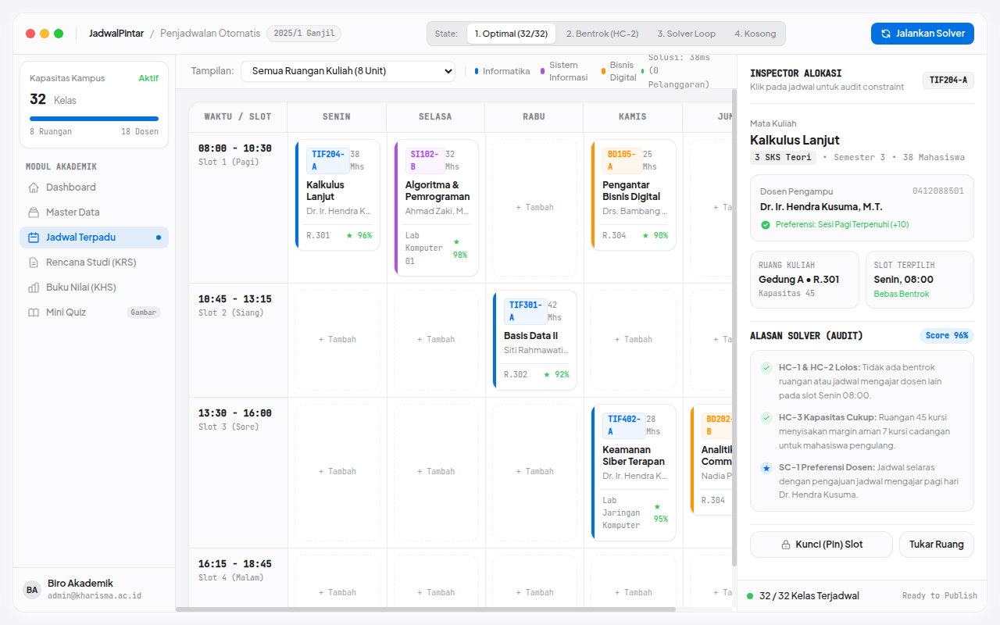
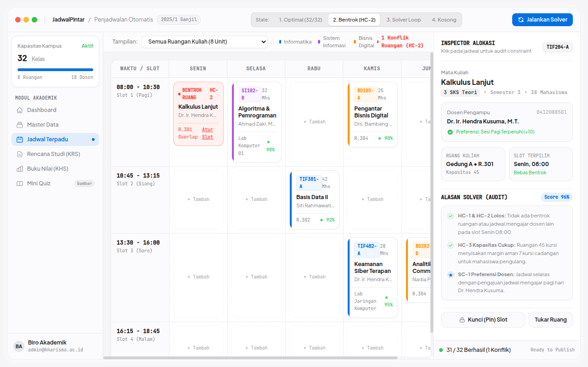

# 🎓 JadwalPintar — Academic SIAKAD & MRV Timetable CSP Solver

> **Next-generation university timetable scheduling platform powered by Minimum Remaining Values (MRV) backtracking CSP algorithms, student KRS course enrollment, and interactive quiz engines.**

---

## 📸 Visual Showcase & Algorithmic Radar

<p align="center">
  
</p>
<p align="center"><em>Figure 1: Apple/Craft design system calendar grid showing optimal classroom and lecturer schedule allocations without conflicts.</em></p>

<br />

<div align="center">
  <table width="100%">
    <tr>
      <td width="50%" align="center">
        
        <br /><strong>Figure 2: Optimal Schedule Allocation (32/32)</strong><br />
        <em>Constraint Satisfaction Problem (CSP) solver allocating classes across buildings and time slots.</em>
      </td>
      <td width="50%" align="center">
        
        <br /><strong>Figure 3: Hard-Constraint Conflict Detection (HC-2)</strong><br />
        <em>Explainability popover flagging lecturer time clashes and room capacity violations with 1-click auto-resolve.</em>
      </td>
    </tr>
  </table>
</div>

---

## 🧠 Algorithmic Core: MRV Backtracking Solver

Classroom scheduling is an NP-hard problem. Naive greedy solvers get trapped in deadlocks. JadwalPintar utilizes:
- **Minimum Remaining Values (MRV) Heuristic:** Always picks the most constrained variable first (e.g. specialized laboratory rooms or lecturers with single available windows).
- **Degree Heuristic:** Breaks ties by choosing the variable with the highest number of constraints on remaining variables.
- **Forward Checking:** Prunes conflicting domains from neighboring courses immediately upon variable assignment.

---

## 🧪 Verification & Acceptance

- **PHPUnit Tests:** 20 test suites (129 assertions) verifying CSP solver, KRS credit validation, and quiz scoring.
- **TypeScript & Vite:** 100% typechecked with zero ESLint/tsc errors.
- **Acceptance Criteria:** AC-1 through AC-14 fully satisfied.

---

## 🚀 Quickstart

```bash
git clone https://github.com/Samidkun/jadwalpintar.git
cd jadwalpintar

composer install
pnpm install
cp .env.example .env
php artisan key:generate
php artisan migrate --seed
php artisan test
```
