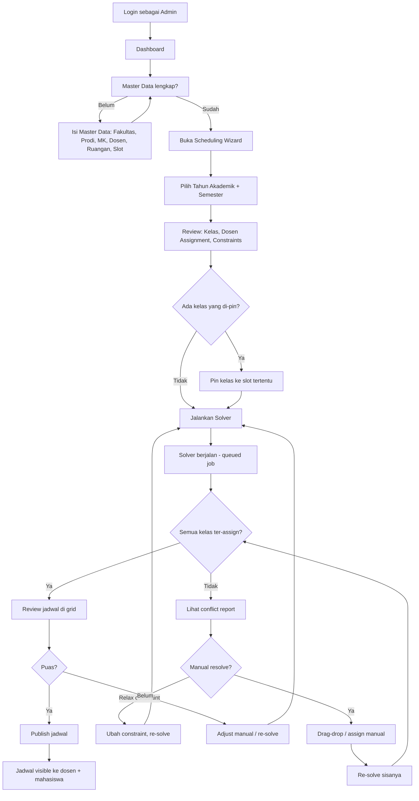
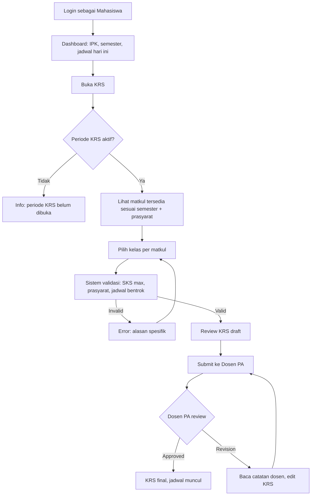
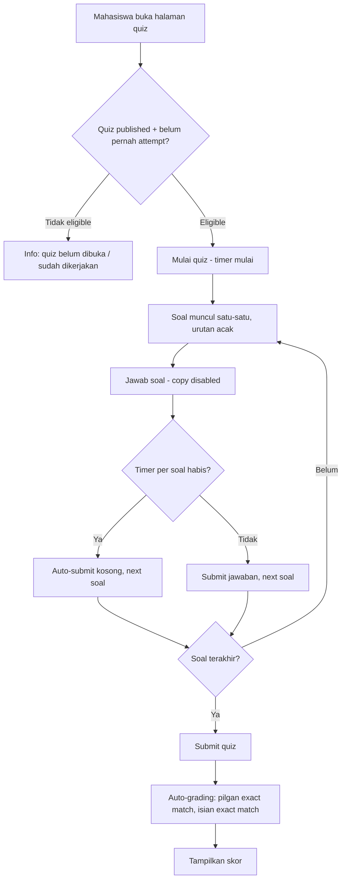
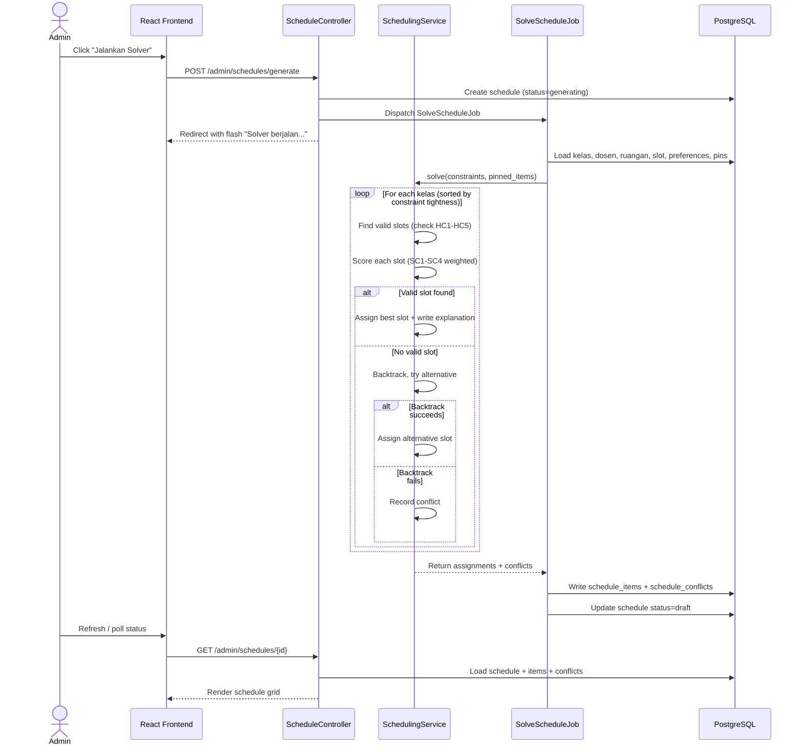
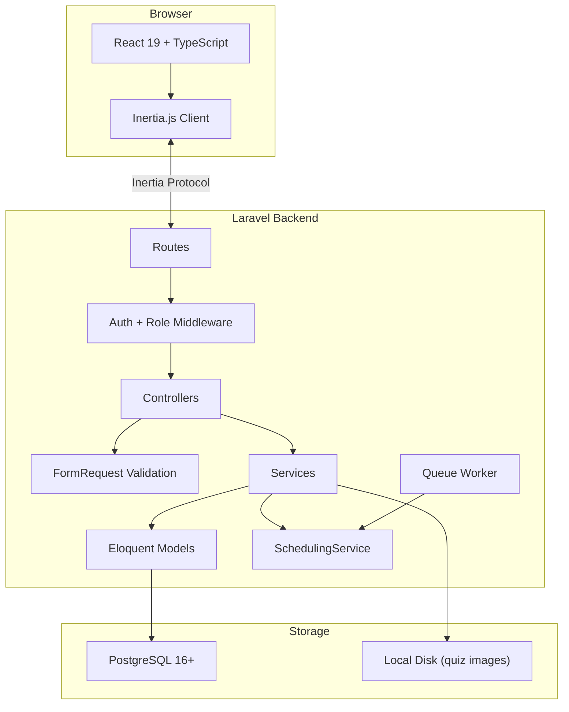

# Diagrams — JadwalPintar

## ERD (from schema)

```mermaid
erDiagram
    users {
        bigint id PK
        string name
        string email UK
        string password
        timestamp email_verified_at
        timestamps timestamps
    }

    fakultas {
        bigint id PK
        string kode UK
        string nama
        timestamps timestamps
    }

    prodi {
        bigint id PK
        string kode UK
        string nama
        bigint fakultas_id FK
        timestamps timestamps
    }

    tahun_akademik {
        bigint id PK
        string tahun "2025/2026"
        enum semester "ganjil|genap"
        boolean aktif
        timestamps timestamps
    }

    mata_kuliah {
        bigint id PK
        string kode UK
        string nama
        int sks
        int semester
        enum tipe "teori|lab"
        bigint prodi_id FK
        timestamps timestamps
    }

    prasyarat_mk {
        bigint id PK
        bigint mata_kuliah_id FK
        bigint prasyarat_id FK "references mata_kuliah"
    }

    dosen {
        bigint id PK
        bigint user_id FK UK
        string nidn UK
        string nama
        string bidang
        bigint prodi_id FK
        timestamps timestamps
    }

    dosen_time_preferences {
        bigint id PK
        bigint dosen_id FK
        enum hari "senin|selasa|rabu|kamis|jumat"
        bigint slot_waktu_id FK
        enum status "preferred|avoid|unavailable"
    }

    ruangan {
        bigint id PK
        string kode UK
        string nama
        int kapasitas
        enum tipe "teori|lab|campuran"
        timestamps timestamps
    }

    slot_waktu {
        bigint id PK
        time jam_mulai
        time jam_selesai
        string label
    }

    kelas {
        bigint id PK
        bigint mata_kuliah_id FK
        bigint dosen_id FK
        bigint tahun_akademik_id FK
        string nama_kelas "A, B, C"
        int kapasitas
        timestamps timestamps
    }

    mahasiswa {
        bigint id PK
        bigint user_id FK UK
        string nim UK
        string nama
        bigint prodi_id FK
        int semester
        enum status "aktif|cuti|lulus|do"
        bigint dosen_pa_id FK "nullable, references dosen"
        timestamp deleted_at
        timestamps timestamps
    }

    krs {
        bigint id PK
        bigint mahasiswa_id FK
        bigint tahun_akademik_id FK
        enum status "draft|submitted|approved|revision"
        text catatan_dosen "nullable"
        timestamps timestamps
    }

    krs_detail {
        bigint id PK
        bigint krs_id FK
        bigint kelas_id FK
    }

    schedules {
        bigint id PK
        bigint tahun_akademik_id FK
        enum status "generating|draft|published"
        jsonb metadata "solver stats"
        timestamps timestamps
    }

    schedule_items {
        bigint id PK
        bigint schedule_id FK
        bigint kelas_id FK
        bigint ruangan_id FK
        bigint slot_waktu_id FK
        enum hari "senin|selasa|rabu|kamis|jumat"
        boolean is_pinned "false"
        text explanation "nullable"
        timestamps timestamps
    }

    schedule_conflicts {
        bigint id PK
        bigint schedule_id FK
        bigint kelas_id FK
        string type
        text description
    }

    nilai {
        bigint id PK
        bigint kelas_id FK
        bigint mahasiswa_id FK
        jsonb komponen "uts,uas,tugas,quiz scores"
        decimal nilai_akhir
        string huruf
        decimal bobot
        timestamps timestamps
    }

    quizzes {
        bigint id PK
        bigint kelas_id FK
        string judul
        int durasi_menit "nullable, null=no timer"
        boolean acak_soal "true"
        boolean acak_pilihan "true"
        boolean satu_percobaan "true"
        enum status "draft|published|closed"
        timestamps timestamps
    }

    soal {
        bigint id PK
        bigint quiz_id FK
        text teks
        string gambar "nullable, path to uploaded image"
        enum tipe "pilgan|isian"
        jsonb pilihan "nullable, for pilgan"
        string jawaban_benar
        int poin
        int urutan
        timestamps timestamps
    }

    quiz_attempts {
        bigint id PK
        bigint quiz_id FK
        bigint mahasiswa_id FK
        jsonb jawaban "soal_id: jawaban"
        int skor
        timestamp started_at
        timestamp submitted_at
        timestamps timestamps
    }

    %% Relationships
    prodi ||--o{ mata_kuliah : "has"
    prodi ||--o{ dosen : "has"
    prodi ||--o{ mahasiswa : "has"
    fakultas ||--o{ prodi : "has"

    users ||--o| dosen : "is"
    users ||--o| mahasiswa : "is"

    mata_kuliah ||--o{ prasyarat_mk : "requires"
    mata_kuliah ||--o{ kelas : "offered as"

    dosen ||--o{ kelas : "teaches"
    dosen ||--o{ dosen_time_preferences : "has"
    dosen ||--o{ mahasiswa : "advises (PA)"

    slot_waktu ||--o{ dosen_time_preferences : "ref"

    tahun_akademik ||--o{ kelas : "in"
    tahun_akademik ||--o{ krs : "in"
    tahun_akademik ||--o{ schedules : "in"

    kelas ||--o{ krs_detail : "enrolled via"
    kelas ||--o{ schedule_items : "scheduled as"
    kelas ||--o{ nilai : "graded in"
    kelas ||--o{ quizzes : "has"

    krs ||--o{ krs_detail : "contains"
    mahasiswa ||--o{ krs : "fills"
    mahasiswa ||--o{ nilai : "receives"
    mahasiswa ||--o{ quiz_attempts : "takes"

    schedules ||--o{ schedule_items : "contains"
    schedules ||--o{ schedule_conflicts : "has"

    ruangan ||--o{ schedule_items : "used in"
    slot_waktu ||--o{ schedule_items : "at"

    quizzes ||--o{ soal : "contains"
    quizzes ||--o{ quiz_attempts : "attempted by"
```

## User Flow — Admin Scheduling



## User Flow — Mahasiswa KRS



## User Flow — Quiz



## Sequence — Scheduling Engine



## Architecture Overview


